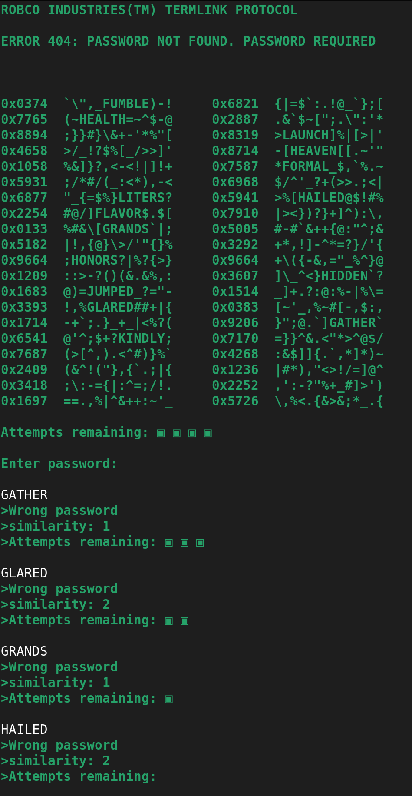
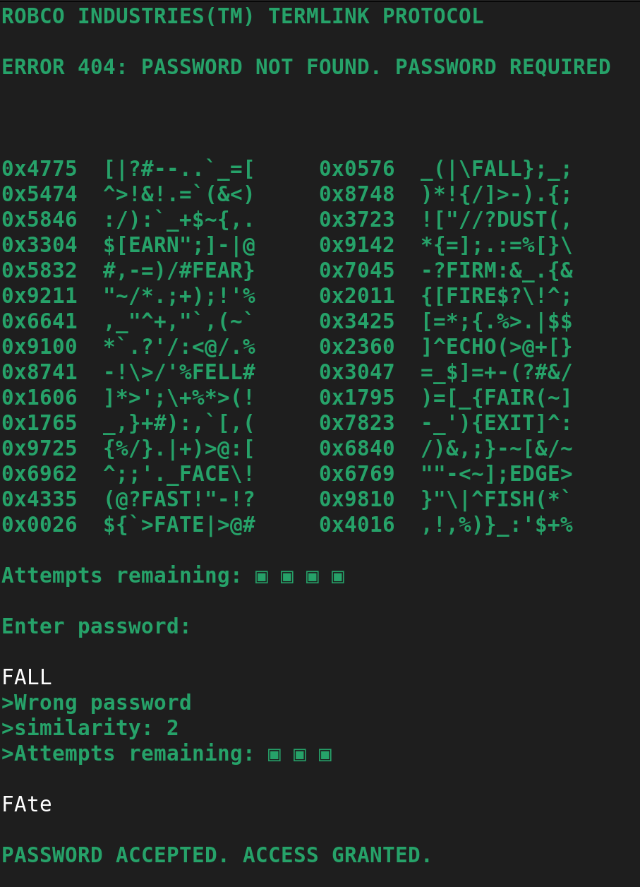

# <h1 align="center">Hackout</h1>

<p align="center">
   <b>A terminal-based password cracking game inspired by Fallout's hacking minigame</b><br>
</p>

---

<p align="center">
    
    
    
    
    
    
    
</p>

## General Description

Hackout is a retro terminal-based password cracking game written in C that faithfully recreates the iconic hacking minigames from the Fallout video game series. Players must identify the correct password hidden among random gibberish in a hex dump-style terminal display. The game features three difficulty levels, realistic terminal aesthetics with green monospace text and typewriter effects, and a sophisticated word injection system that strategically places real words within procedurally generated random characters. Designed for educational and entertainment purposes, Hackout offers an authentic post-apocalyptic computer terminal experience with limited attempts, similarity feedback, and hundreds of words across multiple difficulty tiers.




## Preview

```
WELCOME TO ROBCO INDUSTRIES(TM) TERMLINK(R) MATRIX
PLEASE SELECT ACCESS LEVEL (1-3)

ROBCO INDUSTRIES(TM) TERMLINK PROTOCOL
ERROR 404: PASSWORD NOT FOUND. PASSWORD REQUIRED

0x1234  &#@$LOGIC%^&*  0x5678  !@#$MUSIC
0x9ABC  *()_+DREAM=[]  0xDEFG  {}OCEAN?
0xEF01  <PLANT>?()*+  0x2345  +-*/HAPPY

Attempts remaining: ▣ ▣ ▣ ▣
Enter password:
```

## Build & Execution Instructions

### Prerequisites
- **C Compiler**: GCC or Clang with C99 support or higher
- **Make**: GNU Make utility
- **Unix/Linux Environment**: Terminal with ANSI color support
- **Standard Libraries**: Standard C library with POSIX extensions

### Installation Steps

1. **Clone the repository:**
   ```bash
   git clone https://github.com/hugomgris/Hackout.git
   cd Hackout-0.1
   ```

2. **Install dependencies:**
   - Ensure GCC/Clang is installed on your system
   - On Ubuntu/Debian: `sudo apt-get install build-essential`
   - On macOS: Install Xcode Command Line Tools: `xcode-select --install`
   - On Arch Linux: `sudo pacman -S base-devel`

3. **Build the project:**
   ```bash
   make
   ```

4. **Run the application:**
   ```bash
   ./hackout play
   ```

### Example Usage
```bash
# Quick build and run
make game

# Manual build steps
make clean
make
./hackout play

# Clean build artifacts
make fclean
```

## Detailed Features

### Difficulty Levels
Hackout offers three distinct difficulty levels with increasing complexity and word length:

- **Level 1 (Access Level 1)**: 4-letter words from a pool of 101 carefully selected terms
- **Level 2 (Access Level 2)**: 5-letter words from a pool of 123 diverse vocabulary entries  
- **Level 3 (Access Level 3)**: 6-letter words from a pool of 131 challenging words
- **Progressive Difficulty**: Larger grids and more complex layouts at higher levels
- **Balanced Word Selection**: Words chosen for optimal gameplay difficulty and recognition

**Level Controls:**
- Start the game and select difficulty 1-3 when prompted
- Invalid selections trigger security lockdown simulation
- Each level features unique grid dimensions and word placement strategies

### Terminal Aesthetics
Experience authentic retro computing atmosphere with carefully crafted visual elements:

1. **Green Monospace Display**: Classic terminal green text on black background
2. **Typewriter Effect**: Character-by-character printing with configurable delays
3. **Hex Dump Format**: Realistic memory address display with hex offsets
4. **ROBCO Branding**: Authentic Fallout-universe terminal interface design
5. **Security Messages**: Immersive error messages and access level prompts
6. **ASCII Attempt Counters**: Visual attempt tracking with filled/empty blocks

### Gameplay Mechanics
Advanced password cracking simulation with multiple strategic elements:

- **Pattern Recognition**: Identify real words among random symbol clusters
- **Similarity Feedback**: Receive hints about character matches in correct positions
- **Limited Attempts**: 4 attempts before terminal lockout simulation
- **Word Injection**: Sophisticated algorithm places words in realistic hex dump locations
- **Random Generation**: Procedurally generated gibberish using authentic symbol sets
- **Input Validation**: Case-insensitive password matching with proper sanitization

**Feedback System:**
- **Similarity Score**: Number of correct letters in correct positions
- **Attempt Tracking**: Visual representation of remaining chances
- **Success/Failure States**: Immersive win/lose messages with terminal styling

### Word Database System
Comprehensive word management with categorized vocabulary:

- **Curated Word Lists**: Hand-selected words for optimal gameplay balance
- **File-Based Storage**: Easily modifiable text files for each difficulty level
- **Random Selection**: Dynamic word pool selection for high replayability
- **Balanced Distribution**: Words chosen for recognizability and challenge level

**Word Categories:**
- **Level 1**: Common 4-letter words (ABLE, ACID, AIDE, BAND, BONE...)
- **Level 2**: Varied 5-letter words (ABOUT, ACORN, ACTOR, ADOPT, ALARM...)
- **Level 3**: Complex 6-letter words (ABANDON, ABDUCT, ABJURE, ACCEPT, ACCESS...)

## Controls

### Game Flow Controls
- **Difficulty Selection**: Type `1`, `2`, or `3` to select access level
- **Password Entry**: Type your guess and press Enter
- **Game Exit**: Use `Ctrl+C` to terminate the game

### Navigation
- **Enter**: Submit password attempt
- **Backspace**: Correct typing errors during input
- **Arrow Keys**: Navigate command history (if supported by terminal)

### System Controls
- **Ctrl+C**: Force quit application
- **Ctrl+Z**: Suspend process (Unix systems)

## Technical Architecture

Hackout follows a modular C architecture with clear separation of concerns:

- **Launcher**: Main entry point, difficulty selection, and game initialization
- **Builder**: Procedural grid generation with hex addresses and random symbols
- **Injector**: Strategic word placement within generated character grids
- **Getter**: Word list loading and random selection from difficulty-specific files
- **Manager**: Game state management, input handling, and similarity calculation
- **Printer**: Terminal output with retro styling, colors, and typewriter effects
- **libft**: Custom C library providing essential string and memory operations

### Core Modules

#### Builder Module (`builder.c`)
- **Grid Generation**: Creates hex dump-style display with configurable dimensions
- **Random Symbol Generation**: Uses authentic symbol sets for realistic gibberish
- **Address Formatting**: Generates believable hexadecimal memory addresses
- **Difficulty Scaling**: Adjusts grid size and complexity based on selected level

#### Injector Module (`injector.c`)
- **Strategic Placement**: Intelligent word positioning within symbol clusters
- **Collision Detection**: Ensures words don't overlap or create conflicts
- **Zone Management**: Defines safe injection areas within the hex dump layout
- **Validation System**: Verifies successful word integration without disrupting aesthetics

#### Manager Module (`manager.c`)
- **Input Processing**: Handles user input with proper sanitization and validation
- **Similarity Calculation**: Computes character matches for hint generation
- **Attempt Tracking**: Manages remaining tries and game state progression
- **Win/Loss Logic**: Determines game outcomes and triggers appropriate responses

#### Printer Module (`printer.c`)
- **ANSI Color Support**: Green terminal styling with proper color codes
- **Typewriter Animation**: Character-by-character printing with timing control
- **Terminal Formatting**: Proper line breaks, spacing, and cursor management
- **Cross-platform Compatibility**: Works across different Unix-like systems

This modular design ensures maintainability, extensibility, and performance optimization for smooth terminal-based gameplay.

## Building from Source

### Manual Compilation

```bash
# Build the project
make

# Or build and run immediately
make game

# Clean object files
make clean

# Clean everything
make fclean

# Rebuild from scratch
make re
```

### Make Targets

- `make` or `make all`: Build the executable
- `make game`: Build and run the game immediately
- `make clean`: Remove object files and dependencies
- `make fclean`: Remove all generated files
- `make re`: Clean rebuild
- `make libft`: Build only the libft library

### Advanced Build Options

```bash
# Debug build with symbols
make DEBUG=1

# Verbose compilation output
make VERBOSE=1

# Custom compiler
make CC=clang

# Custom flags
make CFLAGS="-O3 -march=native"
```

## File Structure

```
Hackout-0.1/
├── src/
│   ├── launcher.c      # Main entry point and game initialization
│   ├── builder.c       # Grid generation and hex dump creation
│   ├── printer.c       # Terminal output and visual effects
│   ├── getter.c        # Word list loading and selection
│   ├── injector.c      # Word placement and grid injection
│   └── manager.c       # Game logic and input management
├── include/
│   └── foh.h          # Main header with function prototypes
├── levels/
│   ├── level1.txt     # 4-letter word database (101 words)
│   ├── level2.txt     # 5-letter word database (123 words)
│   └── level3.txt     # 6-letter word database (131 words)
├── libft/             # Custom C library
│   ├── *.c           # Library implementation files
│   ├── libft.h       # Library header
│   ├── ft_printf/    # Printf implementation
│   └── Makefile      # Library build configuration
├── Makefile          # Main build configuration
├── .gitignore        # Git ignore rules
└── README.md         # This documentation
```

## Contributing

Contributions are welcome! Here are some areas for improvement and ways to get involved:

### Enhancement Ideas
- **Additional Difficulty Levels**: Implement levels 4-6 with longer words and complex layouts
- **Hint System**: Add optional hint mechanisms for accessibility
- **Sound Effects**: Terminal beep sequences and authentic computer sounds
- **Save System**: Game statistics tracking and high score persistence
- **Multiplayer Mode**: Network-based competitive password cracking
- **Custom Word Lists**: User-definable vocabulary sets and themes
- **Advanced Graphics**: ASCII art elements and enhanced visual effects
- **Accessibility Features**: Screen reader support and alternative input methods

### Development Setup

1. **Fork the repository** on GitHub
2. **Clone your fork** locally:
   ```bash
   git clone https://github.com/hugomgris/Hackout.git
   cd Hackout-0.1
   ```
3. **Create a feature branch**:
   ```bash
   git checkout -b feature/amazing-new-feature
   ```
4. **Make your changes** and test thoroughly
5. **Commit with descriptive messages**:
   ```bash
   git commit -m "Add configurable difficulty scaling system"
   ```
6. **Push to your fork**:
   ```bash
   git push origin feature/amazing-new-feature
   ```
7. **Open a Pull Request** with detailed description

### Code Standards
- Follow C99 standard with POSIX extensions
- Use consistent indentation (tabs preferred)
- Include comprehensive comments for complex algorithms
- Maintain modular architecture principles
- Add unit tests for new functionality
- Update documentation for user-facing changes

## Known Limitations

### Current Issues
- **Input Buffer Limitation**: Fixed buffer size may truncate very long inputs
- **Memory Management**: Some edge cases in word list loading could be optimized
- **Terminal Compatibility**: Limited testing on older terminal emulators
- **Character Encoding**: ASCII-only support, no Unicode word lists
- **Signal Handling**: Basic interrupt handling, could be more robust

### Platform Limitations
- **Windows Support**: Requires WSL or Cygwin for proper terminal features
- **Color Support**: Depends on terminal ANSI color capability
- **Font Requirements**: Best experience with monospace fonts
- **Screen Size**: Optimal display requires minimum 80x24 terminal

### Performance Considerations
- **Word List Loading**: All words loaded into memory at startup
- **Random Generation**: Pseudo-random, not cryptographically secure
- **Memory Footprint**: Static allocations for grid storage
- **Terminal Output**: Character-by-character printing may be slow on some systems

## Roadmap

### Version 0.2 (Planned)
- [ ] C++ rebuild
- [ ] Configurable word list files
- [ ] Statistics tracking system
- [ ] Improved error handling
- [ ] Enhanced terminal compatibility
- [ ] Performance optimizations

### Version 0.3 (Future)
- [ ] GUI version with SDL/ncurses
- [ ] Network multiplayer support
- [ ] Achievement system
- [ ] Custom difficulty editor
- [ ] Sound and music integration

### Version 1.0 (Vision)
- [ ] Complete Fallout terminal simulation
- [ ] Multiple mini-games
- [ ] Story mode progression
- [ ] Advanced graphics modes
- [ ] Mobile platform support

## License

This project is released under the MIT License. Feel free to use, modify, and distribute as needed.

```
MIT License

Permission is hereby granted, free of charge, to any person obtaining a copy
of this software and associated documentation files (the "Software"), to deal
in the Software without restriction, including without limitation the rights
to use, copy, modify, merge, publish, distribute, sublicense, and/or sell
copies of the Software, and to permit persons to whom the Software is
furnished to do so, subject to the following conditions:

The above copyright notice and this permission notice shall be included in all
copies or substantial portions of the Software.
```

## Inspiration & Acknowledgments

This game is lovingly inspired by the terminal hacking minigames from the **Fallout** series by Bethesda Game Studios. The original concept brilliantly captures the tension and atmosphere of infiltrating abandoned computer systems in a post-apocalyptic world.

### Special Thanks
- **Bethesda Game Studios** for creating the iconic Fallout series and inspiring countless developers
- **42 School** for providing the educational foundation and development environment
- **The C Programming Community** for maintaining excellent documentation and libraries
- **Open Source Contributors** who make projects like this possible

### Technical Inspiration
- **Unix Terminal Games** tradition of text-based entertainment
- **Retro Computing Aesthetics** from 1980s computer terminals
- **Procedural Generation** techniques from classic roguelike games
- **Educational Programming** principles for learning C development

---

*Enjoy cracking those passwords! Remember: In the wasteland, knowledge is power.* ⚡

---
